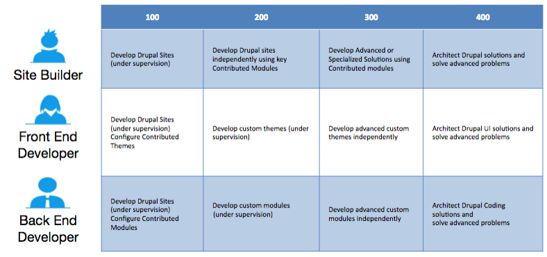

# Preparation

Once you have a list of topics for which you need preparation, you will possibly face two challenges.

1. Find and study documentation and knowledge resources for the topics and,
2. Find enough practical case studies covering the topics.

## 1. Knowledge Resources

Finding documentation and online resources is easier. You may register for Acquia Academy Courses and take a course in the relevant domain to refresh your knowledge.

A list of courses on Acquia Academy can be found at:[https://training.acquia.com/free-training](https://training.acquia.com/free-training). Depending on your area of weakness, you may wish to take one of the following courses:

* Building Websites with Drupal 8
* Drupal 8 Module Development

You can access these courses for free and review them as many times as you like. Many of Acquia Academy courses are available, and if you are in an Acquia enablement or training program, you have been assigned the courses you most require to obtain an initial certification.

Courses follow a model of 100-level for introductory material, 200-level for application of the concepts, 300-level for advanced concepts, and 400-level for solution architecture.Those with more exposure to Drupal 8 concepts, or with demonstrated development experience with Drupal 7, may skip the D8 100-level courses.

We have also made a list of online resources and documentation for each learning domain in the [Study Guide](study-guide.md) section

## 2. Labs / Case Studies

The second challenge of finding enough practical case studies covering the topics is likely to be more daunting. Here are a few ideas and suggestions for finding finding case studies for your preparation:

### Back end development

If you have not worked on backend development or module development, preparing for this part of the exam could appear to be a challenging task. In this case, studying the code of modules developed by your team may or may not help, as modules developed could either be extremely complex or very specific to the requirement or use case. The exam expects that you have an overall understanding of Drupal’s API, core plugin system, and their applications.

We suggest that you attend a module development course and/or build a small module on your own to prepare for this domain. If you cannot attend a training program and are a self-learner, you may try the Examples Module \([https://drupal.org/project/examples](https://drupal.org/project/examples).\)

Examples module provides highly documented working code snippets for many of the Drupal APIs and concepts covered under the blueprint of this exam.

Learn more about the Acquia Certification Program at [https://acquia.com/certification](https://acquia.com/certification)

